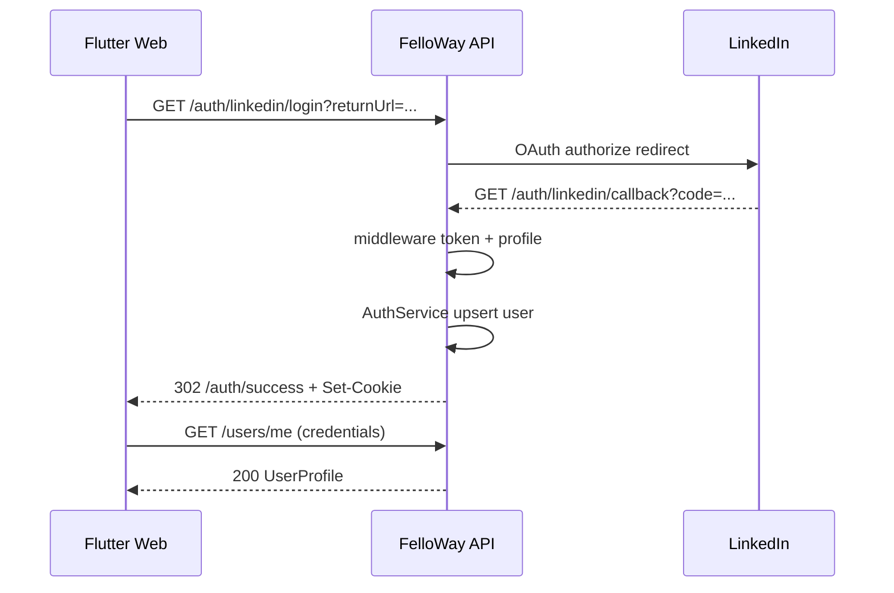
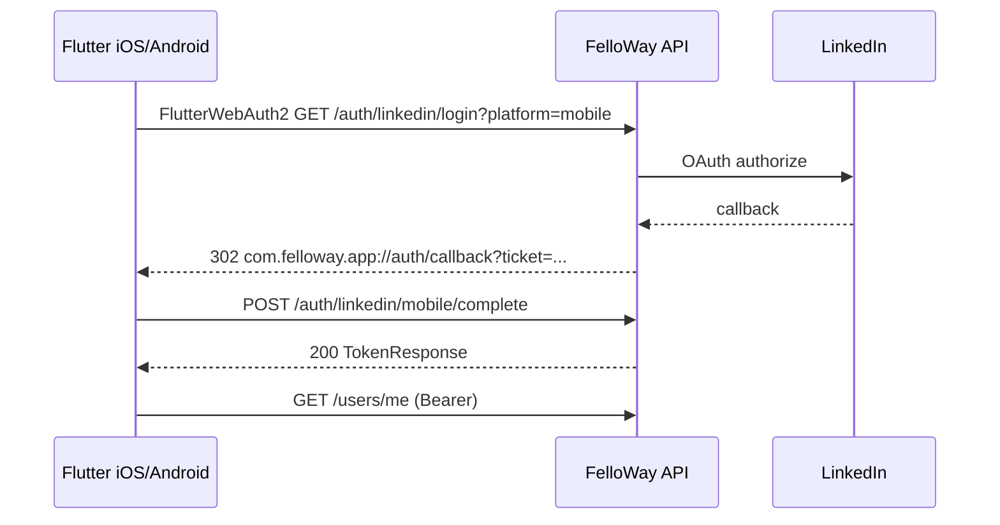

# Contract: LinkedIn BFF OAuth sign-in

**Feature**: `009-linkedin-bff-auth`  
**Date**: 2026-05-20

## Authority

- OpenAPI additions: [`shared/api-contracts/auth/openapi.yaml`](../../../shared/api-contracts/auth/openapi.yaml) (extend in implementation)
- This document: BFF routes, sequences, and platform rules
- **Server OAuth implementation**: `AspNet.Security.OAuth.LinkedIn` — `AddLinkedIn` registers `/auth/linkedin/callback`; `GET /auth/linkedin/login` issues `Challenge(LinkedIn)` (FR-009)

## Endpoints (new / changed)

| Method | Path | Auth | Purpose |
|--------|------|------|---------|
| GET | `/auth/linkedin/login` | Anonymous | Start BFF; `Challenge(LinkedInAuthenticationDefaults.AuthenticationScheme)` via **`AddLinkedIn`** |
| GET | `/auth/linkedin/callback` | Anonymous | **`AddLinkedIn`** middleware callback (LinkedIn redirect URI in portal) |
| POST | `/auth/linkedin/mobile/complete` | Anonymous | Exchange one-time `ticket` → `TokenResponse` |
| GET | `/auth/session` | Cookie or Bearer | Optional: current session probe |
| POST | `/auth/oauth/{provider}/token` | Anonymous | **Deprecated for LinkedIn** when BFF enabled; keep Facebook + dev |

### GET `/auth/linkedin/login`

**Query**:

| Param | Required | Description |
|-------|----------|-------------|
| `returnUrl` | Web: yes | Encoded frontend origin/path for success redirect |
| `platform` | No | `web` (default) or `mobile` |

**Response**: `302` to LinkedIn authorize URL.

### GET `/auth/linkedin/callback`

Registered in LinkedIn Developer Portal as API callback (e.g. `https://localhost:7086/auth/linkedin/callback` local, `https://{api-host}/auth/linkedin/callback` staging). **HTTPS only** for local (FR-016).

**Response**:
- **Web**: `302` to `{returnUrl}/auth/success` with `Set-Cookie` (session)
- **Mobile**: `302` to `com.felloway.app://auth/callback?ticket={uuid}`

**Errors**: `302` to `{returnUrl}/sign-in?error=...` (web) or `com.felloway.app://auth/callback?error=...` (mobile).

### POST `/auth/linkedin/mobile/complete`

**Request**:

```json
{
  "ticket": "550e8400-e29b-41d4-a716-446655440000"
}
```

**Response** `200`: same `TokenResponse` as existing OAuth exchange (`accessToken`, `refreshToken`, `expiresIn`, `userId`).

**Errors**: `400` invalid/expired/consumed ticket; standard error envelope.

## Sequence (web + cookie)



## Sequence (mobile + flutter_web_auth_2)



## Client obligations

| Platform | MUST | MUST NOT |
|----------|------|----------|
| Web | `withCredentials` on API `dio`; open login via same-window navigation | `flutter_web_auth_2`; store LinkedIn tokens |
| Mobile | `flutter_web_auth_2` for login URL only; store API JWT | PKCE; `flutter_appauth` for LinkedIn; parse LinkedIn `code` |
| All | Read auth state via API (`/users/me`, optional `/auth/session`) | POST LinkedIn code to token endpoint |

## LinkedIn Developer Portal

- **Redirect URI**: `{API_BASE}/auth/linkedin/callback` only (not Flutter origin, not custom scheme).
- **Mobile return**: custom scheme handled by API redirect after callback, not registered as LinkedIn redirect.

## Deprecation

When `OAuth:LinkedIn:ClientId` configured:

- `POST /auth/oauth/linkedin/token` with real LinkedIn codes → **400** or **410 Gone** (pick one in implementation; document in OpenAPI).
- Remove reliance on `GET /auth/oauth/linkedin/callback` forwarding `code` to Flutter web.
