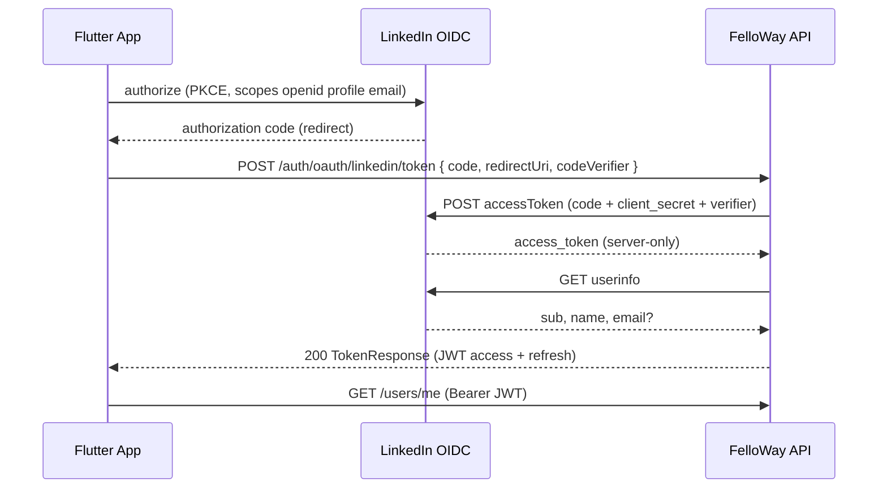

# Contract: LinkedIn OAuth sign-in flow

**Feature**: `main`  
**Date**: 2026-05-19

## Authority

- HTTP request/response: [`shared/api-contracts/auth/openapi.yaml`](../../../shared/api-contracts/auth/openapi.yaml) — `POST /auth/oauth/{provider}/token`
- This document describes **sequence and environment obligations** not duplicated in OpenAPI.

## Sequence (production)



## Request (unchanged)

`POST /auth/oauth/linkedin/token`

```json
{
  "code": "<authorization-code-from-appauth>",
  "redirectUri": "com.felloway.app:/oauthredirect",
  "codeVerifier": "<pkce-verifier>"
}
```

## Response (unchanged)

`200` — `TokenResponse`: `accessToken`, `expiresIn`, `refreshToken`, `userId`.

## Error cases

| Condition | HTTP | Client behavior |
|-----------|------|-----------------|
| Invalid/expired code | 400 | Show sign-in error; no token storage |
| LinkedIn secrets set + `dev-*` code | 400 | Dev shortcut disabled |
| LinkedIn unreachable | 502/503 or 400 with message | Show retry message |
| User banned | 400 domain error | Show account suspended |

## Dev fallback (secrets absent)

Same path and body; `code` values:

- `dev-{subject}` — stable test user
- `test-code` — legacy test subject

## Client obligations

1. MUST NOT send LinkedIn access token as `Authorization` to FelloWay API.
2. MUST pass the same `redirectUri` and `codeVerifier` used in the AppAuth authorize step.
3. MUST store only API tokens from `TokenResponse`.
4. LinkedIn button enabled when `OAUTH_CLIENT_ID` and `OAUTH_DISCOVERY_URL` are set; dev backend button when live mode and OAuth defines unset (FR-010).

## LinkedIn Developer Portal

| Setting | Value |
|---------|--------|
| Redirect URLs | `com.felloway.app:/oauthredirect` (required for mobile) |
| Scopes | OpenID Connect: `openid`, `profile`, `email` |
| Products | Sign In with LinkedIn using OpenID Connect |

Staging API hostname does **not** replace mobile redirect URI; backend exchange is server-to-server.

## Out of scope

- `POST /auth/oauth/facebook/token` behavior changes
- OpenAPI schema version bump
